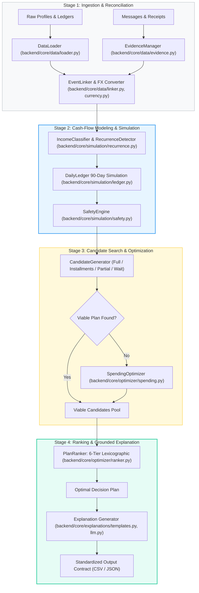
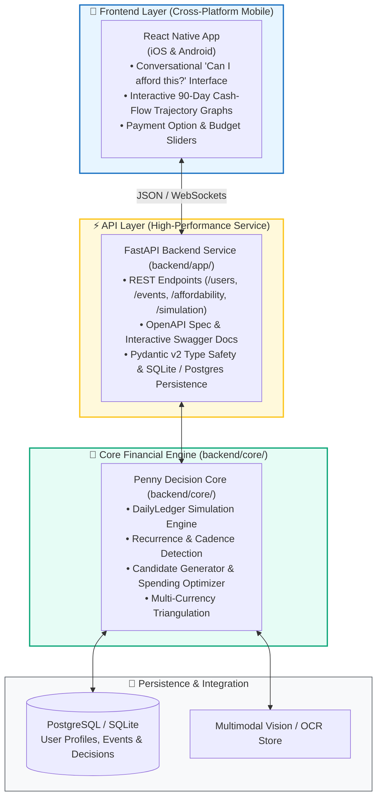

<div align="center">

# 🪙 Penny — AI Financial Affordability Assistant

**Autonomous, Multi-Horizon Financial Decision & Simulation Engine**

[](https://www.python.org/downloads/)
[]()
[]()
[]()
[-61dafb.svg)]()
[]()

[The Vision](#-the-vision) •
[Why Penny?](#-why-penny) •
[Core Capabilities](#-core-capabilities) •
[System Architecture](#-system-architecture) •
[Roadmap & Evolution](#-roadmap--system-evolution) •
[Repository Layout](#-repository-layout) •
[Quick Start](#-quick-start) •
[CLI Reference](#-cli-reference) •
[Backend Guide ➔](backend/README.md) •
[Technical Spec ➔](backend/ARCHITECTURE.md)

</div>

---

## 🌟 The Vision

**Penny** is an autonomous personal financial assistant designed to answer the most universal and critical personal finance question:

> **"Can I afford this?"**

Whether a user is considering buying a laptop, booking a vacation, enrolling in a course, or managing a large unexpected expense, answering *"Can I afford this?"* accurately requires far more than checking `available_balance >= price`. 

Penny models the **future**, not just the present. By simulating cash-flow physics over a forward 90-day horizon, reconciling multimodal evidence (unstructured messages, payroll notices, receipt images), discovering recurring living expense cadences, and respecting personal risk thresholds, Penny gives users safe, personalized, and actionable purchasing decisions.

---

## 💡 Why Penny?

Traditional personal finance tools are **reactive** (categorizing past spending) or **static** (showing current balances). Penny is **proactive, generative, and invariant-driven**:

1. **Beyond the Opening Balance**: A user with \$5,000 in their account may be on the verge of missing rent next week due to pending debits and upcoming living costs. Another user with \$1,000 may have confirmed payroll arriving in two days and can safely finance a purchase. Penny calculates true forward safety.
2. **Zero-Balance Breach Invariant**: Penny guarantees that a recommended purchase will never cause the user's balance to fall below their personalized `minimum_balance_to_keep` at any point over the 90-day forecast.
3. **Multi-Strategy Affordability**: If a user cannot afford an expense in full today, Penny doesn't simply say "No". It searches across 4 actionable strategies:
   - **Full Payment (`full_payment`)**: Pay today if 100% safe across the entire horizon.
   - **Merchant Installments (`installments`)**: Spread payments across vetted merchant financing plans within the user's preferred term limit.
   - **Two-Stage Partial Payment (`partial_payment`)**: Pay a safe partial amount today and the remainder once safe prior to the user's deadline.
   - **Deferred Purchase (`wait`)**: Identify the exact calendar date when cash-flow accumulation makes the full purchase completely safe.
4. **Intelligent Spending Optimization**: If immediate funds fall short, Penny can identify up to 3 non-essential, flexible expenses (e.g., subscriptions or discretionary categories) that the user is willing to stop or reduce to unlock affordability.
5. **Multimodal Grounding**: Financial life doesn't live solely in clean ledger tables. Penny reconciles unstructured evidence — such as OCR receipt values from images, salary increment announcements, payday date shifts, and job status notifications.

---

## 🚀 Core Capabilities

```mermaid
flowchart LR
    A["User Purchase Request<br/>'Can I afford this laptop?'"] --> B["Multimodal Evidence<br/>Reconciliation"]
    B --> C["90-Day Daily Ledger<br/>Cash-Flow Simulation"]
    C --> D["Candidate Generator<br/>(Full, Installments, Partial, Wait)"]
    D --> E["Spending Optimizer<br/>(Flexible Modifications)"]
    E --> F["6-Tier Lexicographic<br/>Plan Ranker"]
    F --> G["Grounded Explanation<br/>& Final Recommendation"]

    style A fill:#f8f9fa,stroke:#495057,stroke-width:1px
    style C fill:#e7f5ff,stroke:#1971c2,stroke-width:2px
    style D fill:#fff9db,stroke:#fcc419,stroke-width:1px
    style F fill:#e6fcf5,stroke:#0ca678,stroke-width:2px
    style G fill:#d3f9d8,stroke:#2b8a3e,stroke-width:2px
```



* 🔬 **90-Day Forward Balance Simulation**: Computes daily balance trajectories $B_t = B_{t-1} + \text{Credits}_t - \text{Debits}_t$ tracking exact headroom relative to minimum balance floors.
* 🔄 **Statistical Recurrence Engine**: Automatically discovers fixed calendar Day-of-Month (DOM mode) streams (salary, rent, utilities) and regular integer day-step cadences (median living expenses over 5, 7, 10, 14, or 21 days).
* 💱 **BFS Multi-Currency Graph**: Dynamically triangulates exchange rates and inverted rates across 5 fiat currencies (`EUR`, `USD`, `INR`, `IDR`, `ZAR`) using dated historical snapshots.
* 🛡️ **Strict Evidence Invariants**: Reserves all pending debits while strictly excluding unconfirmed windfalls, pending refunds, bonuses, or unrealized portfolio fluctuations.
* ⚖️ **Protected vs. Flexible Spending Guardrails**: Never alters protected essentials (rent, food, healthcare). Explores only user-permitted stoppable or reducible categories.
* 🏆 **6-Tier Lexicographic Plan Selection**: Deterministically selects the optimal plan based on:
  1. Completion by deadline
  2. Avoidance of spending modifications
  3. Lowest total payable outflow
  4. Earliest payment start date
  5. Fewest number of payment installments
  6. Merchant option order preservation
* 💬 **Transparent Explanations**: Generates clear, fact-grounded natural-language justifications using verified deterministic synthesizers or few-shot Groq LLM inference.

---

## 🏗️ System Architecture

Penny is structured around a decoupled, 10-stage decision pipeline:



For complete mathematical models, state transitions, and safety proofs, read the [Technical Architecture Specification](backend/ARCHITECTURE.md).

---

## 🗺️ Roadmap & System Evolution

The project is actively expanding from its initial batch evaluation engine into a full-stack, real-time financial advisory platform:



### Architecture Phases

- [x] **Phase 1 — Core Decision Engine (`backend/core/`)**: Deterministic 90-day forward simulation ledger, recurrence detector, multi-currency converter, candidate generation, spending optimizer, and evaluation harness.
- [x] **Phase 2 — API Layer & Persistence (`FastAPI + SQLAlchemy`)**:
  - Clean backend decoupled architecture (`backend/core/` pure simulation domain + `backend/app/` FastAPI service).
  - Database schema & ORM with SQLite / PostgreSQL support, dataset seeder, and repository models.
  - FastAPI REST endpoints for user profile risk metrics (`/users`), financial events (`/events`), affordability checks (`/affordability`), and forward trajectory simulation (`/simulation`).
  - Quantitative cash-flow risk metrics (fixed burn rate, confirmed income, fixed cost ratio, headroom margin, lowest balance date).
  - 103 unit, database, and API integration tests passing.
- [ ] **Phase 3 — Conversational Agent Layer (`LangGraph + Groq`)**:
  - LangGraph stateful multi-agent supervisor and tools (`evaluate_purchase`, `simulate_spending_reduction`, `get_cashflow_trajectory`).
  - Human-in-the-Loop (HITL) approval gates for spending adjustments and budget modifications.
  - Streaming responses (SSE / WebSockets).
- [ ] **Phase 4 — Mobile Frontend (`React Native + Expo`)**:
  - Cross-platform mobile UI for iOS and Android.
  - Conversational "Can I afford this?" chat interface.
  - Interactive 90-day cash-flow trajectory charts against the minimum safety line.
  - One-tap toggles for flexible spending modifications.

---

## 📂 Repository Layout

```text
.
├── README.md                      # Root project overview and roadmap
├── problem_statement.md           # Formal specification, constraints, and requirements
├── output.csv                     # Final generated predictions for benchmark dataset
│
├── backend/                       # 🧠 High-Performance Backend & Financial Engine
│   ├── README.md                  # Dedicated backend developer guide & API documentation
│   ├── ARCHITECTURE.md            # In-depth architectural blueprint & formal specifications
│   ├── pyproject.toml             # Backend package metadata and dependencies
│   ├── requirements.txt           # FastAPI, SQLAlchemy, Pydantic v2, pytest dependencies
│   ├── cli.py                     # Backwards-compatible CLI runner for dataset processing
│   │
│   ├── app/                       # ⚡ FastAPI Service & Persistence Layer
│   │   ├── main.py                # FastAPI application factory & lifespan seeder
│   │   ├── config.py              # Application settings (env vars, DB URLs, CORS)
│   │   ├── api/v1/                # REST endpoints (/users, /events, /affordability, /simulation)
│   │   ├── db/                    # SQLAlchemy ORM models, session maker & dataset seeder
│   │   ├── schemas/               # Pydantic v2 validation contracts & risk response schemas
│   │   └── services/              # Domain orchestration services (FinanceService, SimulationService)
│   │
│   ├── core/                      # 🔬 Pure Python Financial Simulation Domain (Zero Framework Deps)
│   │   ├── pipeline.py            # DecisionPipeline coordinator (10-stage execution)
│   │   ├── models/                # Domain entities & immutable data structures
│   │   ├── data/                  # Ingestion, FX BFS triangulation, evidence & event linking
│   │   ├── simulation/            # Recurrence detector, 90-day DailyLedger, SafetyEngine
│   │   ├── optimizer/             # Candidate generator, spending optimizer, 6-tier ranker
│   │   ├── explanations/          # Deterministic templates & Groq LLM explanation generator
│   │   └── evaluation/            # Benchmark evaluator comparing predictions with ground truth
│   │
│   ├── tests/                     # 🧪 103 Unit, DB & API Integration Tests
│   │   ├── test_core/             # 85 core simulation domain tests
│   │   ├── test_db/               # 5 database & seeder tests
│   │   └── test_api/              # 13 FastAPI endpoint & service integration tests
│   │
│   └── docs/                      # EDA and design specifications
│
├── dataset/                       # Financial data, requests, and evidence files
│   ├── requests.csv               # 250 test requests to evaluate
│   ├── sample_requests.csv        # 25 solved reference requests with ground truth
│   ├── financial_profiles.csv     # User balances, minimum thresholds, and category permissions
│   ├── financial_events.csv       # Historical, pending, and scheduled financial transactions
│   ├── request_payment_options.csv# Available financing and installment options per request
│   ├── exchange_rates.csv         # Dated multi-currency exchange rates
│   ├── messages.csv               # Unstructured user, payroll, and merchant messages
│   ├── images.csv                 # Metadata linking receipt/statement images to events
│   └── media/images/              # Grounded PNG receipt and statement documents
│
└── evaluation/                    # Root benchmark outputs and usage reports
    └── usage_report.md            # Benchmark execution metrics and token accounting
```

---

## ⚡ Quick Start

### Prerequisites
- Python 3.10 or higher
- `uv` or `pip` package manager

### 1. Installation

Clone the repository and install dependencies using `uv` (recommended) or `pip`:

```bash
git clone https://github.com/varunaditya27/penny.git
cd penny
uv venv
source .venv/bin/activate
uv pip install -e backend/
```

### 2. Launch the FastAPI Backend Service

Start the development server with auto-reload:

```bash
uvicorn backend.app.main:app --reload --host 0.0.0.0 --port 8000
```

Once running, visit:
- **Interactive Swagger UI**: [http://127.0.0.1:8000/docs](http://127.0.0.1:8000/docs)
- **Alternative ReDoc UI**: [http://127.0.0.1:8000/redoc](http://127.0.0.1:8000/redoc)
- **API Health Check**: `curl http://127.0.0.1:8000/api/v1/health`

### 3. Environment Setup (Optional)

To configure database connection strings or enable the optional Groq LLM explanation generator, create a `backend/.env` file:

```bash
cp backend/.env.example backend/.env
# Set your Groq API key (optional):
# GROQ_API_KEY=gsk_...
# Set custom database URL (defaults to SQLite penny.db):
# DATABASE_URL=sqlite:///penny.db
```

---

## 💻 CLI Reference

Penny provides a CLI entry point at `backend/cli.py` for batch processing and evaluation:

### Run Full Production Pipeline
Processes all 250 requests in `dataset/requests.csv` and outputs predictions to `output.csv`:

```bash
python3 -m backend.cli --no-llm
```

### Run Benchmark Calibration on Sample Dataset
Evaluates accuracy against the 25 reference cases in `dataset/sample_requests.csv`:

```bash
python3 -m backend.cli --eval-sample --no-llm
```

### Specify Custom Output Path
```bash
python3 -m backend.cli --output /path/to/custom_output.csv
```

### CLI Options

| Option | Type | Default | Description |
|---|---|:---:|---|
| `--eval-sample` | flag | `False` | Run against `sample_requests.csv` and print precision metrics |
| `--output` | string | `None` | Custom output CSV path (defaults to `output.csv`) |
| `--no-llm` | flag | `True` | Use deterministic template synthesizer (fast, zero API cost) |
| `--use-llm` | flag | `False` | Enable Groq API (`openai/gpt-oss-20b`) for explanation drafting |
| `--tolerance` | float | `5.0` | Numerical percentage tolerance for safe amount evaluation |

---

## 🧪 Testing & Verification

Penny maintains an exhaustive test suite with **105 tests** across 3 test layers:
- **Core Engine (`backend/tests/test_core/`)**: 85 tests covering BFS cross-currency conversion, recurrence detection (DOM and step cadences), 90-day ledger simulation, installment schedule generation, and spending optimizer.
- **Database & Seeder (`backend/tests/test_db/`)**: 5 tests verifying SQLAlchemy ORM persistence, relationships, and CSV seeder idempotency.
- **API Endpoints (`backend/tests/test_api/`)**: 15 integration tests validating FastAPI routes, cash-flow risk metrics calculations, 90-day trajectory endpoints, merchant installment plans, and Pydantic schemas.

To run the complete test suite:

```bash
PYTHONPATH=. pytest backend/tests/ -v
```

```text
===================== 105 passed in 21.16s ======================
```

---

## 📋 Decision Contract & Output Schema

For each request evaluated, Penny produces an exact 8-column decision row:

| Column Name | Type | Description |
|---|---|---|
| `request_id` | `string` | Unique request identifier (e.g. `request_01`) |
| `amount_safe_to_pay` | `float` | Largest amount safe to pay today while protecting minimum balance and essentials |
| `affordability_status` | `enum` | `affordable_now`, `affordable_with_plan`, `affordable_later`, or `not_affordable` |
| `recommended_payment_method` | `enum` | `full_payment`, `partial_payment`, `installments`, `wait`, or `not_recommended` |
| `payment_plan` | `string` | Formatted `<date>:<amount>` schedule (e.g. `2026-03-01:500.00\|2026-04-01:500.00`) or `none` |
| `earliest_date_for_full_payment` | `string` | Earliest calendar date when full payment is safe, or empty if never safe within 90 days |
| `spending_changes_needed` | `string` | Recommended modifications (e.g. `stop:event_102\|reduce_to:event_205:50.00`) or `none` |
| `decision_explanation` | `string` | Grounded, concise rationale explaining the financial facts behind the recommendation |

---

## 📚 Technical Documentation & Deep Dives

- **[Backend Service & API Guide](backend/README.md)**: FastAPI service architecture, endpoints specification, database seeder, and developer workflows.
- **[Technical Architecture & Invariants](backend/ARCHITECTURE.md)**: Deep dive into the 90-day simulation engine, cadence detection formulas, multi-currency BFS graph, and ranking algorithms.
- **[Formal Problem Statement](problem_statement.md)**: Original task rules, edge cases, and allowed values.
- **[Specification & Design](backend/docs/specs/2026-09-13-buy-or-wait-design.md)**: In-depth design spec for affordability determination.

---

<div align="center">

**Penny — The AI Financial Affordability Assistant**  
*Built with precision, mathematical safety, and forward-looking financial intelligence.*

</div>
