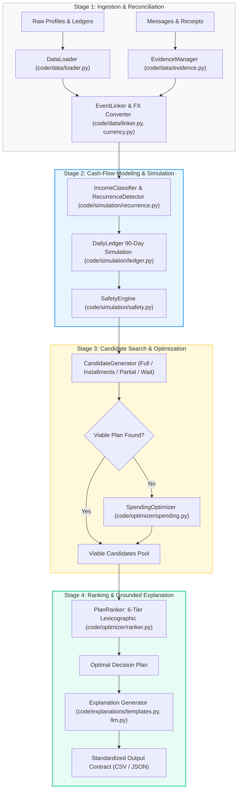
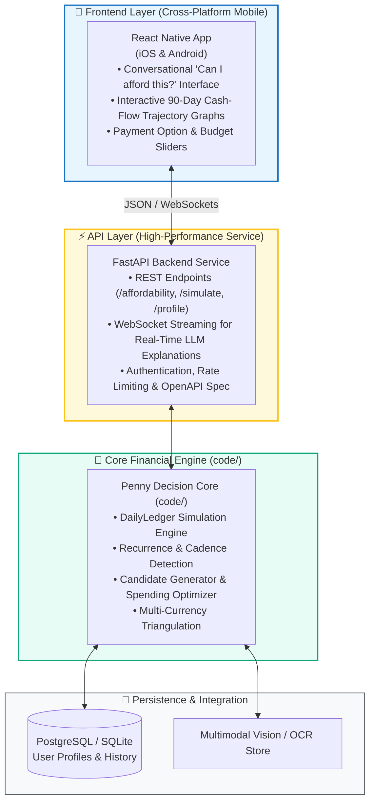

<div align="center">

# 🪙 Penny — AI Financial Affordability Assistant

**Autonomous, Multi-Horizon Financial Decision & Simulation Engine**

[](https://www.python.org/downloads/)
[]()
[]()
[-orange.svg)]()
[-61dafb.svg)]()
[]()

[The Vision](#-the-vision) •
[Why Penny?](#-why-penny) •
[Core Capabilities](#-core-capabilities) •
[System Architecture](#-system-architecture) •
[Roadmap & Evolution](#-roadmap--system-evolution) •
[Repository Layout](#-repository-layout) •
[Quick Start](#-quick-start) •
[CLI Reference](#-cli-reference) •
[Data Contract](#-decision-contract--output-schema) •
[Technical Documentation ➔](code/ARCHITECTURE.md)

</div>

---

## 🌟 The Vision

**Penny** is an autonomous personal financial assistant designed to answer the most universal and critical personal finance question:

> **"Can I afford this?"**

Whether a user is considering buying a laptop, booking a vacation, enrolling in a course, or managing a large unexpected expense, answering *"Can I afford this?"* accurately requires far more than checking `available_balance >= price`. 

Penny models the **future**, not just the present. By simulating cash-flow physics over a forward 90-day horizon, reconciling multimodal evidence (unstructured messages, payroll notices, receipt images), discovering recurring living expense cadences, and respecting personal risk thresholds, Penny gives users safe, personalized, and actionable purchasing decisions.

---

## 💡 Why Penny?

Traditional personal finance tools are **reactive** (categorizing past spending) or **static** (showing current balances). Penny is **proactive, generative, and invariant-driven**:

1. **Beyond the Opening Balance**: A user with \$5,000 in their account may be on the verge of missing rent next week due to pending debits and upcoming living costs. Another user with \$1,000 may have confirmed payroll arriving in two days and can safely finance a purchase. Penny calculates true forward safety.
2. **Zero-Balance Breach Invariant**: Penny guarantees that a recommended purchase will never cause the user's balance to fall below their personalized `minimum_balance_to_keep` at any point over the 90-day forecast.
3. **Multi-Strategy Affordability**: If a user cannot afford an expense in full today, Penny doesn't simply say "No". It searches across 4 actionable strategies:
   - **Full Payment (`full_payment`)**: Pay today if 100% safe across the entire horizon.
   - **Merchant Installments (`installments`)**: Spread payments across vetted merchant financing plans within the user's preferred term limit.
   - **Two-Stage Partial Payment (`partial_payment`)**: Pay a safe partial amount today and the remainder once safe prior to the user's deadline.
   - **Deferred Purchase (`wait`)**: Identify the exact calendar date when cash-flow accumulation makes the full purchase completely safe.
4. **Intelligent Spending Optimization**: If immediate funds fall short, Penny can identify up to 3 non-essential, flexible expenses (e.g., subscriptions or discretionary categories) that the user is willing to stop or reduce to unlock affordability.
5. **Multimodal Grounding**: Financial life doesn't live solely in clean ledger tables. Penny reconciles unstructured evidence — such as OCR receipt values from images, salary increment announcements, payday date shifts, and job status notifications.

---

## 🚀 Core Capabilities

```mermaid
flowchart LR
    A["User Purchase Request<br/>'Can I afford this laptop?'"] --> B["Multimodal Evidence<br/>Reconciliation"]
    B --> C["90-Day Daily Ledger<br/>Cash-Flow Simulation"]
    C --> D["Candidate Generator<br/>(Full, Installments, Partial, Wait)"]
    D --> E["Spending Optimizer<br/>(Flexible Modifications)"]
    E --> F["6-Tier Lexicographic<br/>Plan Ranker"]
    F --> G["Grounded Explanation<br/>& Final Recommendation"]

    style A fill:#f8f9fa,stroke:#495057,stroke-width:1px
    style C fill:#e7f5ff,stroke:#1971c2,stroke-width:2px
    style D fill:#fff9db,stroke:#fcc419,stroke-width:1px
    style F fill:#e6fcf5,stroke:#0ca678,stroke-width:2px
    style G fill:#d3f9d8,stroke:#2b8a3e,stroke-width:2px
```



* 🔬 **90-Day Forward Balance Simulation**: Computes daily balance trajectories $B_t = B_{t-1} + \text{Credits}_t - \text{Debits}_t$ tracking exact headroom relative to minimum balance floors.
* 🔄 **Statistical Recurrence Engine**: Automatically discovers fixed calendar Day-of-Month (DOM mode) streams (salary, rent, utilities) and regular integer day-step cadences (median living expenses over 5, 7, 10, 14, or 21 days).
* 💱 **BFS Multi-Currency Graph**: Dynamically triangulates exchange rates and inverted rates across 5 fiat currencies (`EUR`, `USD`, `INR`, `IDR`, `ZAR`) using dated historical snapshots.
* 🛡️ **Strict Evidence Invariants**: Reserves all pending debits while strictly excluding unconfirmed windfalls, pending refunds, bonuses, or unrealized portfolio fluctuations.
* ⚖️ **Protected vs. Flexible Spending Guardrails**: Never alters protected essentials (rent, food, healthcare). Explores only user-permitted stoppable or reducible categories.
* 🏆 **6-Tier Lexicographic Plan Selection**: Deterministically selects the optimal plan based on:
  1. Completion by deadline
  2. Avoidance of spending modifications
  3. Lowest total payable outflow
  4. Earliest payment start date
  5. Fewest number of payment installments
  6. Merchant option order preservation
* 💬 **Transparent Explanations**: Generates clear, fact-grounded natural-language justifications using verified deterministic synthesizers or few-shot Groq LLM inference.

---

## 🏗️ System Architecture

Penny is structured around a decoupled, 10-stage decision pipeline:



For complete mathematical models, state transitions, and safety proofs, read the [Technical Architecture Specification](code/ARCHITECTURE.md).

---

## 🗺️ Roadmap & System Evolution

The project is actively expanding from its initial batch evaluation engine into a full-stack, real-time financial advisory platform:



### Architecture Phases

- [x] **Phase 1 — Core Decision Engine (`code/`)**: Deterministic 90-day forward simulation ledger, recurrence detector, multi-currency converter, candidate generation, spending optimizer, and evaluation harness.
- [ ] **Phase 2 — API Layer (`FastAPI`)**:
  - Restructure `code/` into a modular backend engine package (`penny.core`).
  - Implement FastAPI REST endpoints for real-time affordability checks, scenario simulations, and user budget profiles.
  - Add WebSocket endpoints for streaming AI reasoning and interactive budget changes.
  - Interactive OpenAPI / Swagger UI documentation.
- [ ] **Phase 3 — Mobile Frontend (`React Native`)**:
  - Beautiful, reactive mobile user interface for iOS and Android.
  - Natural conversational input: *"I want to buy an iPad for $650. Can I do it before the end of the month?"*
  - Interactive balance graphs visualizing the 90-day projected trajectory against the minimum safety line.
  - One-tap toggle for spending modifications (e.g. *"Pause Netflix & Gym for 2 months to unlock this purchase"*).

---

## 📂 Repository Layout

```text
.
├── README.md                      # You are here: Root project overview and roadmap
├── problem_statement.md           # Formal specification, constraints, and requirements
├── requirements.txt               # Project dependencies (python-dotenv, requests)
├── output.csv                     # Final generated predictions for benchmark dataset
│
├── code/                          # 🧠 Backend Logic & Core Simulation Engine
│   ├── README.md                  # Developer guide, CLI usage & module documentation
│   ├── ARCHITECTURE.md            # In-depth architectural blueprint & formal specifications
│   ├── main.py                    # Top-level CLI driver & execution orchestrator
│   ├── pipeline.py                # DecisionPipeline coordinator (10-stage execution)
│   │
│   ├── models/                    # Domain entities & immutable data structures
│   │   ├── domain.py              # UserProfile, FinancialEvent, PurchaseRequest, PaymentOption
│   │   └── results.py             # CandidatePlan, OutputRow, AffordabilityStatus, PaymentMethod
│   │
│   ├── data/                      # Ingestion, normalization & evidence reconciliation
│   │   ├── loader.py              # DataLoader reading dataset CSVs with sample isolation
│   │   ├── currency.py            # ExchangeRateConverter with BFS multi-currency graph
│   │   ├── evidence.py            # EvidenceManager applying image receipts & message mutations
│   │   ├── linker.py              # EventLinker resolving linked transaction lifecycles
│   │   └── classifier.py          # IncomeStreamClassifier filtering confirmed vs non-cash credits
│   │
│   ├── simulation/                # 90-day daily balance simulation & recurrence
│   │   ├── recurrence.py          # RecurrenceDetector (calendar DOM + integer step cadences)
│   │   ├── ledger.py              # DailyLedger forward simulator & headroom evaluator
│   │   └── safety.py              # SafetyEngine computing safe amounts & earliest full payment date
│   │
│   ├── optimizer/                 # Candidate search, spending optimization & ranking
│   │   ├── candidates.py          # CandidateGenerator (full, installment, partial, wait)
│   │   ├── spending.py            # SpendingOptimizer (two-tier modification search)
│   │   └── ranker.py              # PlanRanker implementing 6-tier lexicographic tie-breaking
│   │
│   ├── explanations/              # Grounded rationale & explanation synthesis
│   │   ├── templates.py           # DeterministicTemplateSynthesizer matching benchmark style
│   │   └── llm.py                 # LLMExplanationGenerator with graceful template fallback
│   │
│   ├── evaluation/                # Scoring, validation & token tracking
│   │   ├── evaluator.py           # Evaluator comparing predictions with sample ground truth
│   │   └── usage_report.md        # Token and model cost report
│   │
│   └── tests/                     # Exhaustive unit and regression test suite (85 tests)
│
├── dataset/                       # Financial data, requests, and evidence files
│   ├── requests.csv               # 250 test requests to evaluate
│   ├── sample_requests.csv        # 25 solved reference requests with ground truth
│   ├── financial_profiles.csv     # User balances, minimum thresholds, and category permissions
│   ├── financial_events.csv       # Historical, pending, and scheduled financial transactions
│   ├── request_payment_options.csv# Available financing and installment options per request
│   ├── exchange_rates.csv         # Dated multi-currency exchange rates
│   ├── messages.csv               # Unstructured user, payroll, and merchant messages
│   ├── images.csv                 # Metadata linking receipt/statement images to events
│   └── media/images/              # Grounded PNG receipt and statement documents
│
├── evaluation/                    # Root benchmark outputs and usage reports
│   └── usage_report.md            # Benchmark execution metrics and token accounting
```

---

## ⚡ Quick Start

### Prerequisites
- Python 3.10 or higher
- `pip` or `uv` package manager

### 1. Installation

Clone the repository and install dependencies:

```bash
git clone https://github.com/varunaditya27/penny.git
cd penny
python3 -m venv .venv
source .venv/bin/activate
pip install -r requirements.txt
```

*(Note: Penny's core simulation engine uses standard library algorithms and has zero mandatory runtime dependencies. `requirements.txt` installs `python-dotenv` and `requests` for optional LLM explanation generation).*

### 2. Environment Setup (Optional)

If you wish to enable the LLM explanation generator via Groq, create a `.env` file in the project root:

```bash
cp .env.example .env
# Set your Groq API key:
# GROQ_API_KEY=gsk_...
```

If the key is not set, Penny operates deterministically with zero degradation in accuracy or speed.

---

## 💻 CLI Reference

Penny's main entry point is [`code/main.py`](code/main.py):

### Run Full Production Pipeline
Processes all 250 requests in `dataset/requests.csv` and outputs predictions to `output.csv`:

```bash
python3 code/main.py --no-llm
```

### Run Benchmark Calibration on Sample Dataset
Evaluates accuracy against the 25 reference cases in `dataset/sample_requests.csv`:

```bash
python3 code/main.py --eval-sample --no-llm
```

### Specify Custom Output Path
```bash
python3 code/main.py --output /path/to/custom_output.csv
```

### CLI Options

| Option | Type | Default | Description |
|---|---|:---:|---|
| `--eval-sample` | flag | `False` | Run against `sample_requests.csv` and print precision metrics |
| `--output` | string | `None` | Custom output CSV path (defaults to `output.csv`) |
| `--no-llm` | flag | `True` | Use deterministic template synthesizer (fast, zero API cost) |
| `--use-llm` | flag | `False` | Enable Groq API (`openai/gpt-oss-20b`) for explanation drafting |
| `--tolerance` | float | `5.0` | Numerical percentage tolerance for safe amount evaluation |

---

## 🧪 Testing & Verification

Penny maintains an exhaustive unit and integration test suite with **85 tests** covering:
- BFS cross-currency conversion graph and rate inversion
- Recurrence pattern detection (DOM and step cadences)
- 90-day ledger simulation and balance headroom invariants
- Installment schedule generation and post-term safety
- Spending optimizer category constraints
- Template formatting and CLI drivers

To run the complete test suite:

```bash
PYTHONPATH=. python3 -m unittest discover code/tests
```

```text
Ran 85 tests in 18.081s

OK
```

---

## 📋 Decision Contract & Output Schema

For each request evaluated, Penny produces an exact 8-column decision row:

| Column Name | Type | Description |
|---|---|---|
| `request_id` | `string` | Unique request identifier (e.g. `request_01`) |
| `amount_safe_to_pay` | `float` | Largest amount safe to pay today while protecting minimum balance and essentials |
| `affordability_status` | `enum` | `affordable_now`, `affordable_with_plan`, `affordable_later`, or `not_affordable` |
| `recommended_payment_method` | `enum` | `full_payment`, `partial_payment`, `installments`, `wait`, or `not_recommended` |
| `payment_plan` | `string` | Formatted `<date>:<amount>` schedule (e.g. `2026-03-01:500.00\|2026-04-01:500.00`) or `none` |
| `earliest_date_for_full_payment` | `string` | Earliest calendar date when full payment is safe, or empty if never safe within 90 days |
| `spending_changes_needed` | `string` | Recommended modifications (e.g. `stop:event_102\|reduce_to:event_205:50.00`) or `none` |
| `decision_explanation` | `string` | Grounded, concise rationale explaining the financial facts behind the recommendation |

---

## 📚 Technical Documentation & Deep Dives

- **[Technical Architecture & Invariants](code/ARCHITECTURE.md)**: Deep dive into the 90-day simulation engine, cadence detection formulas, multi-currency BFS graph, and ranking algorithms.
- **[Codebase Developer Guide](code/README.md)**: Detailed component breakdown, class diagrams, and test specifications.
- **[Formal Problem Statement](problem_statement.md)**: Original task rules, edge cases, and allowed values.

---

<div align="center">

**Penny — The AI Financial Affordability Assistant**  
*Built with precision, mathematical safety, and forward-looking financial intelligence.*

</div>
