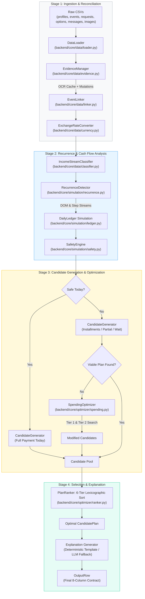
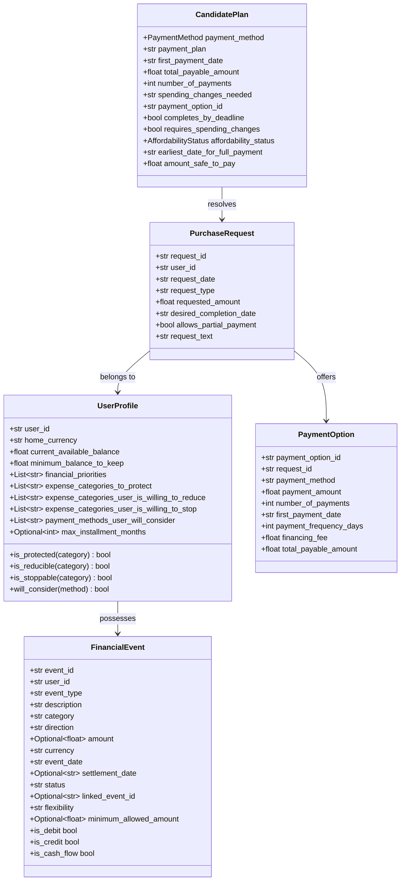
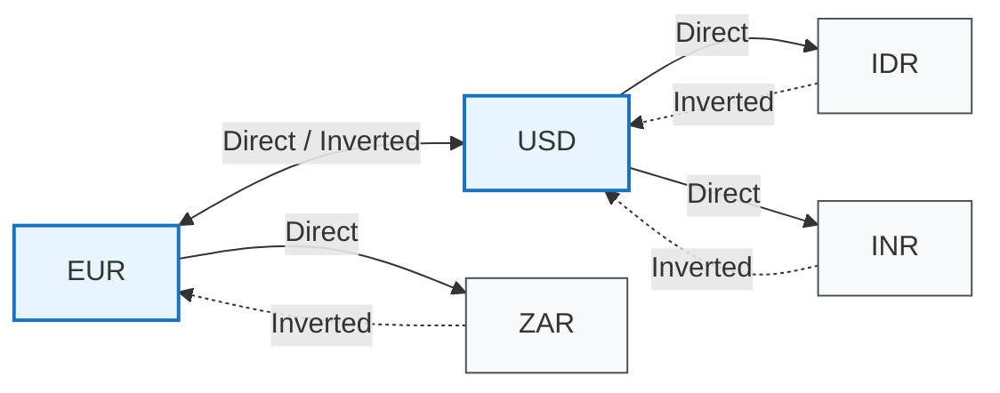
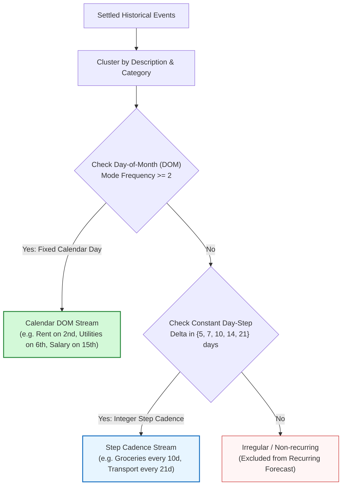
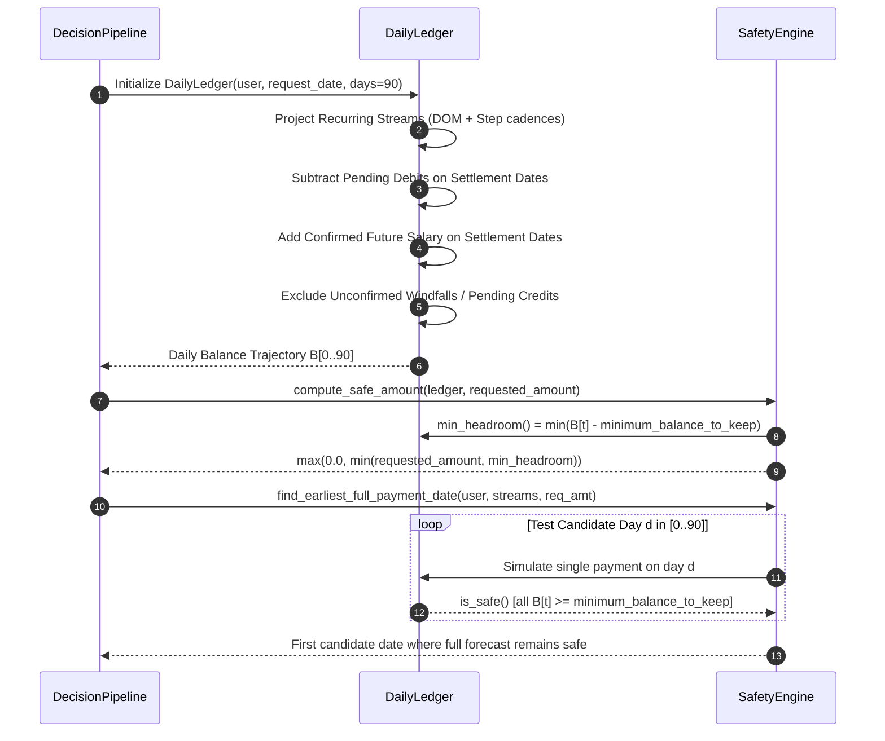
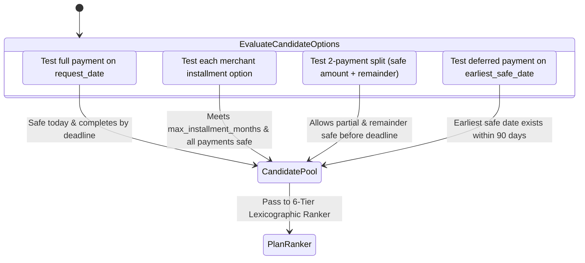
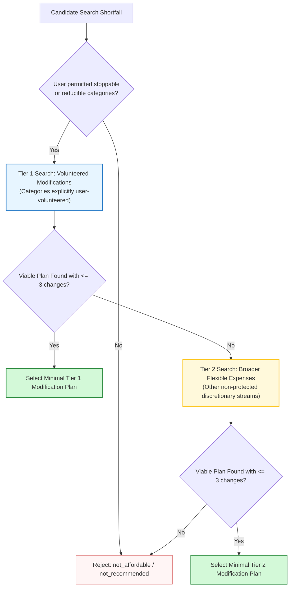
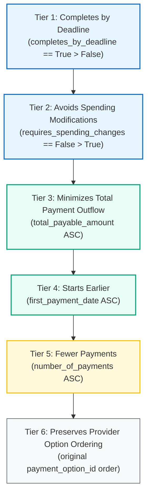
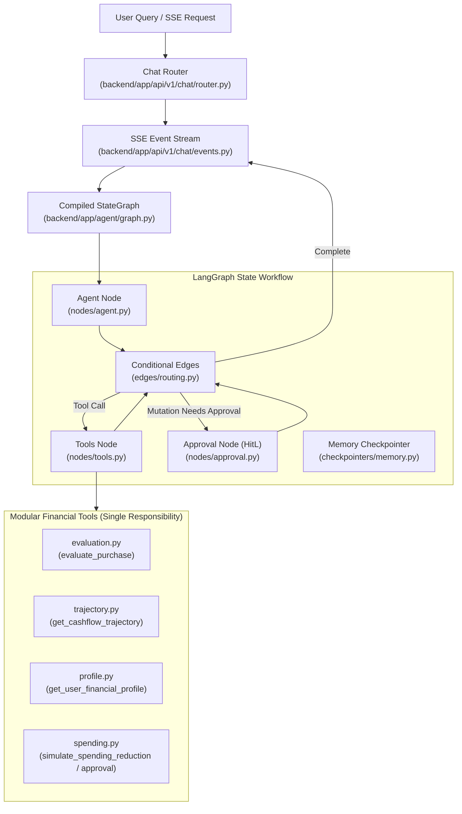

# 🏛️ Buy or Wait? — Architecture & Technical Specification

**End-to-End System Design, Simulation Engine Mechanics, and Financial Safety Invariants**

[1. Architectural Overview](#1-architectural-overview) •
[2. Domain Entities & Data Contracts](#2-domain-entities--data-contracts) •
[3. Multimodal Evidence Reconciliation](#3-multimodal-evidence-reconciliation) •
[4. Multi-Currency Conversion Graph](#4-multi-currency-conversion-graph) •
[5. Recurrence Engine & Cadence Detection](#5-recurrence-engine--cadence-detection) •
[6. 90-Day Daily Ledger & Safety Invariants](#6-90-day-daily-ledger--safety-invariants) •
[7. Candidate Generation & Search Space](#7-candidate-generation--search-space) •
[8. Two-Tier Spending Modification Optimizer](#8-two-tier-spending-modification-optimizer) •
[9. 6-Tier Lexicographic Plan Ranker](#9-6-tier-lexicographic-plan-ranker) •
[10. Explanation Generation](#10-explanation-generation) •
[11. Modular Agentic Architecture](#11-modular-agentic-architecture) •
[← Return to README](README.md)

---

> 📘 **Looking for execution instructions, CLI flags, or testing commands?**  
> Refer to the companion developer guide in [`README.md`](./README.md).

---

## 1. Architectural Overview

The **Buy or Wait?** system is designed as a decoupled, multi-stage financial pipeline that determines the affordability of a purchase request over a conservative 90-day forward simulation window.

---

## 2. Domain Entities & Data Contracts

All core domain models are defined as immutable Python dataclasses in [`backend/core/models/domain.py`](./core/models/domain.py) and [`backend/core/models/results.py`](./core/models/results.py).

### Core Dataclasses

---

## 3. Multimodal Evidence Reconciliation

Supporting evidence in `dataset/images.csv` and `dataset/messages.csv` contains untrusted evidence that may confirm missing transaction amounts, announce job promotions, change salary dates, or volunteer subscription cancellations.

[`EvidenceManager`](./data/evidence.py) applies evidence deterministically without allowing prompt injections or external instructions to breach the challenge rules:

1. **Receipt Image Reconciliation**:
   - `images.csv` contains image references (`image_01.png` to `image_25.png`).
   - Where a historical transaction has a missing or null amount (`amount` is blank in `dataset/financial_events.csv`), [`EvidenceManager`](./core/data/evidence.py) extracts the grounded OCR receipt value from [`backend/core/cache/image_amounts.json`](./core/cache/image_amounts.json) and injects the verified amount.
2. **Message Mutation Extraction**:
   - Unstructured messages in `dataset/messages.csv` are parsed for lifecycle events:
     - `STOP_INCOME`: Signals employment termination (`user_05`), halting ongoing recurring payroll projections.
     - `AMEND_SALARY`: Updates baseline compensation following confirmed promotion letters.
     - `AMEND_PAYROLL_DATE`: Overrides the salary calendar day-of-month (`DOM`) to match newly scheduled company payroll dates (e.g. `message_05` moving payday to the 23rd).
     - `CANCEL_SUBSCRIPTION`: Identifies voluntary cancellations announced by the user (e.g. streaming or cloud storage).
     - `NEW_JOB`: Schedules future confirmed employment credits after an onboarding confirmation.

---

## 4. Multi-Currency Conversion Graph

Exchange rates in `dataset/exchange_rates.csv` are dated snapshots on the 15th of each month for direct pairs (`EUR->USD`, `EUR->ZAR`, `USD->EUR`, `USD->IDR`, `USD->INR`). Foreign transactions must be converted into the user's `home_currency`.

[`ExchangeRateConverter`](./data/currency.py) models currencies as a directed graph and dynamically computes rates using Breadth-First Search (BFS) triangulation and mathematical rate inversion.

### Rate Selection Rules:
1. **As-Of Settlement Date Matching**: Selects the latest snapshot with $\text{rate\_date} \le \text{settlement\_date}$ (or earliest available rate if the event predates the exchange rate table).
2. **Identity**: If $\text{from\_currency} == \text{to\_currency}$, returns $1.0$.
3. **Inversion**: If only $(B \to A)$ is published, rate $(A \to B) = \frac{1.0}{\text{rate}(B \to A)}$.
4. **BFS Triangulation**: If converting between non-direct pairs (e.g. $\text{ZAR} \to \text{INR}$), the converter runs BFS path search: $\text{ZAR} \to \text{EUR} \to \text{USD} \to \text{INR}$, multiplying path edge weights.

---

## 5. Recurrence Engine & Cadence Detection

To forecast future expenses without inventing unsupported patterns, [`RecurrenceDetector`](./simulation/recurrence.py) analyzes settled historical transactions and detects two orthogonal recurrence archetypes:

### 1. Fixed Calendar Day-of-Month (`DOM`)
- Applied to regular monthly commitments (Rent, Utilities, Subscriptions, Confirmed Salary).
- Extracts statistical mode of day-of-month across historical settled occurrences.
- Projects on day $D$ of each month across the 90-day simulation window.

### 2. Integer Day-Step Cadences (`step`)
- Applied to living expenses occurring at constant interval steps: $\Delta t \in \{5, 7, 10, 14, 21\}$ days.
- Anchors to the most recent historical transaction date and projects subsequent events at intervals of $t_{\text{latest}} + k \cdot \Delta t$.
- Baseline amount is calculated as the **median** of historical settled instances to remain robust against noisy outliers.

---

## 6. 90-Day Daily Ledger & Safety Invariants

The heart of the system is the deterministic [`DailyLedger`](./simulation/ledger.py) simulation engine. It tracks the exact daily balance trajectory:

$$B_t = B_{t-1} + \sum \text{Credits}_t - \sum \text{Debits}_t \quad \text{for } t \in [0, 90]$$

Starting on `request_date` ($t = 0$) with $B_0 = \text{current\_available\_balance}$.

### The Three Financial Invariants
1. **The Strict Minimum Balance Invariant**:
   At no point during the 90-day forecast may the balance fall below the user's threshold:
   $$\min_{t \in [0, 90]} B_t \ge \text{minimum\_balance\_to\_keep}$$
2. **Pending Debit Reservation Invariant**:
   All pending debits are reserved and subtracted on their designated settlement dates. Pending credits, refunds, lottery gains, and investment valuations are strictly ignored until settled.
3. **Confirmed Salary Inflow Invariant**:
   Only confirmed ongoing employment salaries are credited on their settlement date. Terminated contracts or unconfirmed gig platform payouts are excluded.

---

## 7. Candidate Generation & Search Space

Given a purchase request, [`CandidateGenerator`](./optimizer/candidates.py) evaluates 4 potential payment methods:

1. **Full Payment Today (`full_payment`)**:
   Safe if a single deduction of `requested_amount` on `request_date` maintains $B_t \ge \text{minimum\_balance\_to\_keep}$ for all $t \in [0, 90]$.
2. **Installments (`installments`)**:
   Iterates through options in `request_payment_options.csv`. Rejects options exceeding `user.max_installment_months`. Simulates all recurring installment dates and verifies balance remains $\ge \text{minimum\_balance\_to\_keep}$ throughout.
3. **Partial Payment (`partial_payment`)**:
   Generated only when:
   - `request.allows_partial_payment == True`
   - `user.will_consider("partial_payment") == True`
   - $0 < \text{amount\_safe\_to\_pay} < \text{requested\_amount}$
   - The second payment ($\text{requested\_amount} - \text{amount\_safe\_to\_pay}$) is scheduled on `earliest_date_for_full_payment` on or before `desired_completion_date`.
4. **Deferred Payment (`wait`)**:
   Schedules a single full payment on `earliest_date_for_full_payment` (the first date where post-inflow cashflow keeps the entire subsequent forecast safe).

---

## 8. Two-Tier Spending Modification Optimizer

If no candidate plan is safe without modifications, [`SpendingOptimizer`](./optimizer/spending.py) executes a targeted combinatorial search across flexible non-protected expenses:

### Search Constraints:
- **Maximum 3 modifications**: At most three `stop:<event_id>` or `reduce_to:<event_id>:<amount>` actions.
- **Strict Protection Invariant**: Categories in `expense_categories_to_protect` (e.g. rent, groceries) are strictly forbidden from modification.
- **Minimum Allowed Floor**: When reducing an event, the new amount cannot fall below `event.minimum_allowed_amount`.

---

## 9. 6-Tier Lexicographic Plan Ranker

When multiple candidate plans are financially viable, [`PlanRanker`](./optimizer/ranker.py) applies a strict 6-tier lexicographic tie-breaking hierarchy to select the optimal plan:

---

## 10. Explanation Generation

The final recommendation is explained through concise, grounded natural language:
- **Deterministic Synthesizer ([`ExplanationTemplateSynthesizer`](./explanations/templates.py))**:
  Formats verified sentences directly matching the benchmark style (e.g. `"Pay EUR 600 today. This leaves at least EUR 800 available over the next 90 days."`).
- **LLM Generator ([`LLMExplanationGenerator`](./explanations/llm.py))**:
  When `GROQ_API_KEY` is configured, calls Groq API (`openai/gpt-oss-20b`) with few-shot calibration. If unconfigured or encountering network latency, it seamlessly and gracefully falls back to the deterministic template without interrupting execution.

---

## 11. Modular Agentic Architecture

The conversational financial assistant is engineered using **LangGraph** with a strict **single-responsibility modular architecture** to avoid file bloat. No single file contains multiple concerns:

### Module Responsibilities:
1. **`state.py`**: Declares `AgentState` schema, message reducer, decision cards, and pending approval structures.
2. **`prompts/`**:
   - `system.py`: Penny assistant persona, 90-day simulation rules, safety floor enforcement.
   - `templates.py`: Human-in-the-loop spending approval and decision summary templates.
3. **`tools/`**:
   - `evaluation.py`: Connects purchase evaluation to `FinanceService`.
   - `trajectory.py`: Simulates 90-day trajectory with `SimulationService`.
   - `profile.py`: Retrieves user preferences, budgets, and cash flow risk metrics.
   - `spending.py`: Simulates category reductions and triggers approval requests.
   - `factory.py`: Unified dependency-injected tool registry.
4. **`nodes/`**:
   - `agent.py`: Tool-bound model invocation with graceful deterministic fallback.
   - `tools.py`: Executes tool calls and updates structured state (`decision_card`, `pending_action`).
   - `approval.py`: Evaluates human approval responses for budget alterations.
5. **`edges/`**:
   - `routing.py`: Pure routing logic between agent, tools, approval gate, and END.
6. **`checkpointers/`**:
   - `memory.py`: In-memory multi-turn conversational checkpointing per session ID.
7. **`api/v1/chat/`**:
   - `events.py`: Formats W3C standard SSE lines and coordinates async event stream.
   - `router.py`: FastAPI endpoints for `POST /api/v1/chat/stream` and `POST /api/v1/chat/approve`.

---

**HackerRank Orchestrate (September 2026) — Buy or Wait?**  
*Review developer commands, CLI flags, and test suite: [Developer Guide (README.md) ➔](README.md)*

