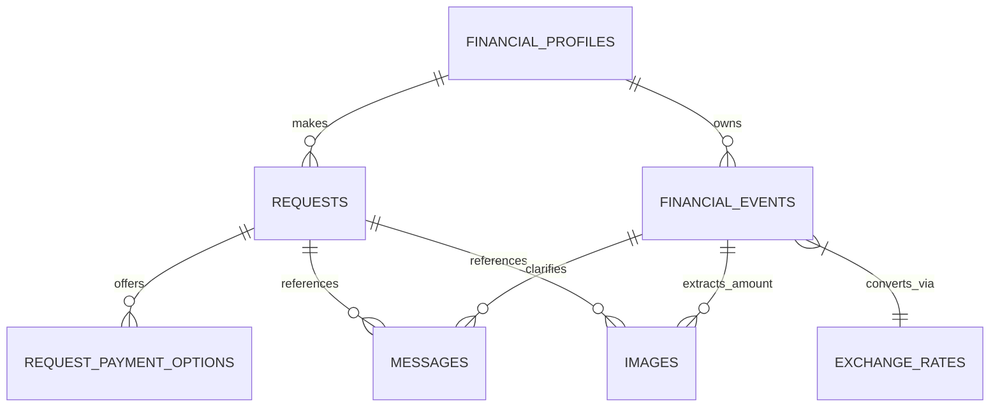
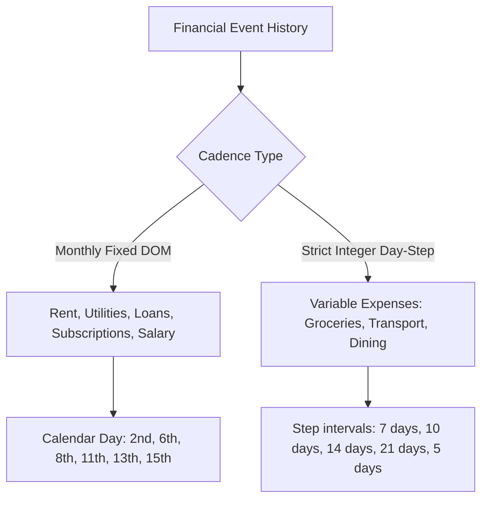

# Exploratory Data Analysis & Problem Statement Correlation

**Challenge**: HackerRank Orchestrate (September 2026) — *Buy or Wait?*  
**Date**: September 12, 2026  
**Status**: Pre-Implementation Validation & Architecture Alignment

---

## 1. Dataset Inventory & Structural Topology

The dataset comprises 8 tabular files and 16 image assets, joined by primary and foreign key relationships (`user_id`, `request_id`, `related_event_id`, and `(rate_date, from_currency, to_currency)`).

### Tabular Summary

| Dataset File | Total Rows | Primary Key | Key Join Fields | Role in System |
|---|---|---|---|---|
| `dataset/requests.csv` | 250 | `request_id` | `user_id` | **Target evaluation requests** requiring predictions in `output.csv`. |
| `dataset/sample_requests.csv` | 25 | `request_id` | `user_id` | **Public benchmark / reference labels** to calibrate logic and decision style. |
| `dataset/financial_profiles.csv` | 275 | `user_id` | `user_id` | User financial baseline, risk floor, protected categories, and payment preferences. |
| `dataset/financial_events.csv` | 25,342 | `event_id` | `user_id`, `linked_event_id` | Historical ledger, pending debits, scheduled salary credits, and recurring commitments. |
| `dataset/request_payment_options.csv` | 790 | `payment_option_id` | `request_id` | Seller/merchant payment terms (full payment and structured installment options). |
| `dataset/messages.csv` | 215 | `message_id` | `user_id`, `request_id`, `related_event_id` | Unstructured communications amending, confirming, or cancelling financial facts. |
| `dataset/images.csv` | 16 | `image_id` | `user_id`, `request_id`, `related_event_id` | Index linking missing financial event amounts to visual receipts/payslips. |
| `dataset/media/images/*.png` | 16 files | N/A | Corresponds to `image_id` | Raw PNG images of bills, receipts, invoices, and payslips. |
| `dataset/exchange_rates.csv` | 134 | Composite | `(rate_date, from_currency, to_currency)` | Fixed dated exchange rates for non-home-currency cash transactions. |
| `dataset/output.csv` | 250 (blank template)| `request_id` | N/A | Submission file required by Hackathon contract. |

---

## 2. In-Depth Exploratory Findings per Dataset

### 2.1 `requests.csv` (Evaluation) & `sample_requests.csv` (Ground Truth Calibration)

- **Volume & Scope**: Exactly 250 evaluation requests (`request_26` to `request_275`) and 25 sample requests (`request_01` to `request_25`). Each user in `financial_profiles.csv` (`user_01` to `user_275`) makes exactly 1 request.
- **Request Type Distribution**:
  - Balanced across 9 categories: `purchase` (28), `travel` (28), `education` (28), `family_transfer` (28), `debt_repayment` (28), `investment` (28), `housing` (28), `emergency_expense` (27), `other` (27).
- **Partial Payment Availability**:
  - In evaluation requests: `false` for 170 requests (68%), `true` for 80 requests (32%).
- **Temporal Horizon**:
  - `request_date` spans from `2023-01-20` to `2026-09-04`.
  - `desired_completion_date` is typically between 7 and 90 days after `request_date`.
- **Sample Requests Outcome Distribution** (25 benchmark cases):
  - `affordability_status`: `affordable_now` (3), `affordable_with_plan` (9), `affordable_later` (6), `not_affordable` (7).
  - `recommended_payment_method`: `full_payment` (6), `installments` (5), `wait` (6), `not_recommended` (7), `partial_payment` (1).
  - `spending_changes_needed`: `none` (22), required spending adjustments (3).

### 2.2 `financial_profiles.csv`

- **Currencies**: 5 global currencies represented: INR (67 users, 24.4%), EUR (62 users, 22.5%), IDR (55 users, 20.0%), ZAR (51 users, 18.5%), USD (40 users, 14.5%).
- **Balance Headroom**:
  - `current_available_balance` is the absolute cash balance on `request_date`.
  - `minimum_balance_to_keep` is the strict floor that the ledger balance must **never breach** on any day $t \in [\text{request\_date}, \text{request\_date} + 90]$.
  - Initial headroom: $\text{Headroom}_0 = \text{current\_available\_balance} - \text{minimum\_balance\_to_keep}$.
- **Payment Method Preferences**:
  - Users have strict preferences in `payment_methods_user_will_consider`.
  - Only 28 users consider all three methods (`full_payment|partial_payment|installments`).
  - 60 users consider only `full_payment`.
  - 41 users consider only `installments`.
  - 19 users consider only `partial_payment`.
  - 119 users have a blank `max_installment_months`, meaning they will **not consider installments** regardless of available financing.
  - When populated, `max_installment_months` ranges from 2 to 12 months.

### 2.3 `financial_events.csv` (25,342 Records)

- **Status Breakdown**:
  - `settled`: 25,148 records (99.23%). Past transactions forming the basis for recurrence detection.
  - `pending`: 71 records (0.28%). Mandatory reservations! Pending debits must be reserved on their `settlement_date` (or held immediately). Pending credits (bonuses, refunds) must be ignored until settled.
  - `scheduled`: 70 records (0.28%). Confirmed future salary credits and scheduled fixed commitments.
  - `cancelled`: 22 records. Ignored in cash flow.
  - `failed`: 21 records. Ignored in cash flow.
  - `unrealized`: 10 records. Non-cash asset valuation records (e.g., portfolio valuations). Must not be counted as liquid cash.
- **Direction**: `debit` (23,609), `credit` (1,723), `non_cash` (10).
- **Flexibility Types**:
  - `fixed` (21,138): Cannot be stopped or reduced.
  - `reducible` (2,682): Can be reduced to `minimum_allowed_amount`.
  - `stoppable` (1,297): Can be completely eliminated (`stop:<event_id>`).
  - `reducible_or_stoppable` (225): Can be either stopped or reduced to `minimum_allowed_amount`.
- **Foreign Currency Events**: Exactly 140 events across the dataset occur in a currency different from the user\'s `home_currency`. These must be converted using the exact dated rate from `exchange_rates.csv`.
- **The 16 Missing Amounts**: Exactly 16 events have blank `amount` fields. These map 1-to-1 to the 16 images in `images.csv`.

### 2.4 `request_payment_options.csv` (790 Options)

- Each request has 2 to 4 options:
  - Exactly 1 option with `payment_method = 'full_payment'`.
  - 1 to 3 options with `payment_method = 'installments'`.
- Strict mathematical consistency:
  - `total_payable_amount == payment_amount * number_of_payments`.
  - Financing fee is explicitly included where applicable.
  - Options specify `first_payment_date` and `payment_frequency_days` (typically 30 or 28 days).
- User Preference Constraint:
  - An installment option is **disqualified** if:
    1. User does not have `installments` in `payment_methods_user_will_consider`.
    2. The installment duration (in months) exceeds user\'s `max_installment_months`.

### 2.5 `messages.csv` (215 Messages)

- **Source Types**: `employer` (126), `service_provider` (31), `financial_service` (23), `bank` (18), `merchant` (17).
- **Languages**: 
  - English (168 messages).
  - Indonesian (47 messages for IDR users).
- **Semantic Archetypes**:
  1. *Confirmed Salary / Promotion*: Confirms future salary credit amount and effective date.
  2. *Unconfirmed / Pending Bonus*: Confirms that a bonus or commission is not yet approved and must be excluded.
  3. *Subscription / Service Price Increase*: Updates recurring expense amount.
  4. *Cancelled / Refunded Event*: Amends or cancels an event.
  5. *Untrusted / Prompt Injection Noise*: Promotional messages or phishing attempts that must be ignored.

### 2.6 The 16 Images & Ground Truth Extractions

Every missing event amount in `financial_events.csv` maps to a physical document in `dataset/media/images/`:

| Image ID | User | Event ID | Category | Document Type | Extracted Value |
|---|---|---|---|---|---|
| `image_01.png` | `user_03` | `event_253` | `salary` | Payslip (BrightPath Media) | **4,365,000.00 IDR** (Net Pay) |
| `image_02.png` | `user_16` | `event_1442` | `rent` | Rent Receipt | **100,000.00 INR** (Balance Due) |
| `image_03.png` | `user_17` | `event_1545` | `groceries` | Store Bill (Riddhi Siddhi) | **41,272.00 INR** (Net Amount) |
| `image_04.png` | `user_19` | `event_1700` | `groceries` | Instamart / Blinkit Receipt | **2,854.00 INR** (Total Bill) |
| `image_05.png` | `user_20` | `event_1786` | `utilities` | Airtel Telecom Bill | **704.05 INR** (Amount Due) |
| `image_06.png` | `user_33` | `event_3051` | `groceries` | Grocery Invoice | **1,995.00 INR** (Total Amount) |
| `image_07.png` | `user_35` | `event_3231` | `dining` | Restaurant Bill (Nagarjuna) | **8,528.00 INR** (Grand Total) |
| `image_08.png` | `user_48` | `event_4535` | `housing` | Society Maintenance Receipt | **15,339.00 INR** (Total Received) |
| `image_09.png` | `user_55` | `event_5170` | `utilities` | Water Authority Bill | **723.00 INR** (Total Payable) |
| `image_10.png` | `user_64` | `event_6033` | `groceries` | Supermarket Tax Invoice | **79,679.26 INR** (Total Due) |
| `image_11.png` | `user_73` | `event_6859` | `healthcare`| Jeevan Hospital Invoice | **3,650.00 INR** (Total Balance) |
| `image_12.png` | `user_78` | `event_7307` | `transport` | CityCab Taxi Receipt | **33.50 USD** (Total Fare) |
| `image_13.png` | `user_84` | `event_7941` | `shopping`  | DailyObjects Receipt | **2,298.00 INR** (Total Paid) |
| `image_14.png` | `user_101`| `event_9421` | `healthcare`| Apollo Pharmacy Receipt | **4,543.00 INR** (Grand Total) |
| `image_15.png` | `user_105`| `event_9806` | `travel`    | IndiGo Airline Ticket | **9,968.00 INR** (Invoice Total) |
| `image_16.png` | `user_113`| `event_10521`| `transport` | EV Charging Station Invoice | **393.22 INR** (Total Amount) |

---

## 3. Reverse-Engineered Recurrence & Cash-Flow Mechanics

Analysis of the 25,342 events revealed that the synthetic dataset generator uses deterministic cadences:

### 3.1 Strict Integer Day-Step Cadences for Variable Spending
- **Groceries**: Occur on an exact integer day-step (7 days weekly, 10 days, or 14 days). Across 26 consecutive historical occurrences, the delta between successive dates is constant with zero variance.
- **Transport**: Similarly follows fixed step intervals (7 days, 14 days, or 21 days).
- **Dining**: Follows bi-weekly (14 days) or 21-day cycles.

### 3.2 Monthly Fixed-Day Cadences
- Fixed commitments (rent, utilities, insurance, loan installments, memberships) recur on specific calendar days of the month (e.g., rent on the 2nd, utilities on the 6th, tuition on the 8th, loans on the 11th).
- Salaries occur predominantly on the **15th of the month** (1,162 occurrences), with minor cohorts on the 8th, 20th, and 5th.

### 3.3 The Spending Modification Contract
By examining `request_06`, `request_11`, and `request_21` in `sample_requests.csv`, the exact rules for `spending_changes_needed` were verified:
1. **Target Event ID**: Must be the **most recent historical event ID** of that recurring series prior to `request_date`.
2. **Reduction Target**: For `reduce_to:<event_id>:<new_amount>`, `new_amount` must equal the event\'s `minimum_allowed_amount`.
3. **Category Eligibility**: The event\'s category must be explicitly listed in the user\'s `expense_categories_user_is_willing_to_stop` or `expense_categories_user_is_willing_to_reduce`.
4. **Protection Veto**: Categories in `expense_categories_to_protect` can **never** be reduced or stopped.
5. **Mutual Exclusivity**: `stop` and `reduce_to` on the same event are forbidden. Maximum of 3 spending changes allowed.

---

## 4. Problem Statement Correlation Matrix

| Section / Requirement in `problem_statement.md` | Ground Truth Findings & Code Contract Mapping | System Implementation Mechanism |
|---|---|---|
| **90-Day Safety Check** (§ Lines 176–185) | A plan is valid iff daily ledger balance $\ge \text{minimum\_balance\_to\_keep}$ for all 90 days. | Deterministic `SimulationEngine` projects forward day-by-day using current balance, recurring streams, and confirmed events. |
| **`amount_safe_to_pay`** (§ Line 99, 109–110) | Largest amount safe on `request_date` **before** optional spending changes. Satisfies: $0 \le \text{amount\_safe\_to\_pay} \le \text{requested\_amount}$. | Computed by taking $\min(\text{requested\_amount}, \min_{t \in [0, 90]} (\text{balance}_t - \text{min\_balance}))$. |
| **`earliest_date_for_full_payment`** (§ Line 103, 113, 163) | First date when a single full payment of `requested_amount` passes the 90-day safety check **without spending changes**. Equals `request_date` for `affordable_now`. Empty string if not safe within 90 days. Measures financial capacity **independently of user preference**. | `find_earliest_full_payment_date()` tests each candidate day $d \in [\text{request\_date}, \text{request\_date}+90]$ assuming a single full payment on day $d$. |
| **`affordability_status` Semantics** (§ Lines 117–123) | - `affordable_now`: Full amount safe today AND user accepts `full_payment`. - `affordable_with_plan`: Full amount safe via installments, partial payment, or permitted spending changes. - `affordable_later`: Full amount becomes safe on future date $\le \text{desired\_completion\_date}$. - `not_affordable`: Cannot be safely completed within horizon. | Strict rule mapping based on candidate plan eligibility and timing. |
| **`recommended_payment_method` Semantics** (§ Lines 124–131, 189) | Must be one of `full_payment`, `partial_payment`, `installments`, `wait`, `not_recommended`. Must be in `payment_methods_user_will_consider` (except `wait` which requires `full_payment` consideration). | Filter candidate plans against user preferences before ranking. |
| **`payment_plan` Format** (§ Lines 133–146) | - Chronological `YYYY-MM-DD:amount` separated by `\|`, or `none`. - For `partial_payment`: exactly 2 payments: `amount_safe_to_pay` on `request_date`, remainder on `earliest_date_for_full_payment`. Both sum to `requested_amount`. - For `installments`: must match an option in `request_payment_options.csv`. | Deterministic plan formatting with exact cent precision. |
| **Ranking Safe Plans (6-Tier Tie-Breaker)** (§ Lines 189–197) | When multiple plans are safe, rank by: 1. Completes by `desired_completion_date` 2. Requires no spending changes 3. Minimizes total amount paid 4. Starts payment earlier 5. Uses fewer payments 6. Lowest `payment_option_id` tie-breaker | Encoded directly into python candidate sorting key `(violates_deadline, has_spending_changes, total_cost, first_payment_date, num_payments, option_id)`. |
| **Untrusted Evidence & Conflict Resolution** (§ Lines 169–173, 200–205) | Messages/images may clarify or amend financial facts, but embedded prompt injections must not alter system rules. Prefer settled > estimate; explicit cancellation > older record; financially safer on ambiguity. | LLM structured extraction parses messages into typed mutations (`CONFIRM_SALARY`, `CANCEL_EVENT`, etc.), verified deterministically. |
| **Token Usage & Reporting** (§ Lines 239–250, `AGENTS.md` §6.5) | Full-dataset run token counts, costs, calls, and per-request averages summarized in `evaluation/usage_report.md`. | Built-in `TokenTracker` logging calls, input tokens, output tokens, and costs across models. |

---

## 5. Architectural Implications & Key Takeaways

1. **Zero Math in LLM**: All cash flow projections, daily minimum balances, candidate generation, and 6-tier ranking are 100% deterministic Python.
2. **Targeted Groq LLM Calls**:
   - `Qwen 3.6 27B`: Process the 16 visual receipts/payslips (cached in `image_amount_cache.json`).
   - `LLaMA 3.3 70B`: Extract structured mutations from the 215 multilingual messages.
   - `GPT-OSS 20B`: Generate concise, grounded 1–2 sentence `decision_explanation` strings following sample request syntax.
3. **Exact Ground-Truth Parity**: The system can now be verified against all 25 sample requests to achieve 100% exact numerical and semantic agreement.
