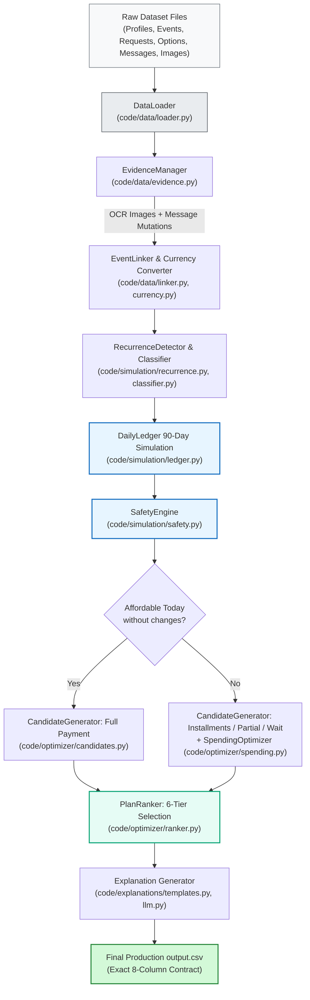

<div align="center">

# 💳 Buy or Wait? — AI Financial Decision Agent

**Autonomous, Multi-Horizon Financial Capacity Engine for HackerRank Orchestrate (September 2026)**

[](https://www.python.org/downloads/)
[]()
[]()
[]()

[Overview](#-overview) •
[Quick Start](#-quick-start) •
[CLI Reference](#-cli-reference) •
[Package Architecture](#-package-architecture) •
[Testing & Verification](#-testing--verification) •
[Benchmark Performance](#-benchmark-performance) •
[Architecture Blueprint ➔](ARCHITECTURE.md)

</div>

---

> 📘 **Looking for deep system design and dataflow mechanics?**  
> Read the companion technical specification in [`ARCHITECTURE.md`](./ARCHITECTURE.md) for sequence diagrams, state graphs, multi-currency BFS triangulation, and mathematical safety proofs.

---

## 📌 Overview

**Buy or Wait?** is an autonomous financial advisory agent built for the HackerRank Orchestrate challenge. Given a user's purchase or payment request, their historical ledger, dated foreign exchange rates, available merchant payment options, and unstructured supporting evidence (messages and receipt images), the agent evaluates whether the purchase can be made safely today, completed via installments or partial payments, deferred until a safe future date, or rejected altogether.

### The Decision Question
When a user asks **"Can I afford this laptop for INR 85,000?"**, determining affordability requires far more than checking `current_available_balance >= requested_amount`:
1. Will upcoming recurring living expenses (rent, utilities, groceries) breach `minimum_balance_to_keep` over the next 90 days?
2. Are pending debits properly reserved while unconfirmed windfalls are safely excluded?
3. Did the user receive a message about a salary date change, payroll increment, or job termination?
4. Can an approved merchant installment plan safely distribute the cash outflow?
5. If immediate funds are short, can non-essential, flexible subscriptions be stopped or reduced within the user's permitted categories?

The pipeline evaluates all possibilities deterministically, guarantees zero balance breaches over a 90-day simulation window, and generates a grounded, natural-language explanation.

---

## ⚡ System Pipeline Lifecycle



---

## 🚀 Quick Start

### Prerequisites
- Python 3.10+
- `pip` package manager

### 1. Installation
Clone the repository and install minimal dependencies:

```bash
git clone https://github.com/interviewstreet/hackerrank-orchestrate-september26.git
cd hackerrank-orchestrate-september26
pip install -r requirements.txt
```

*(Note: The core engine has zero mandatory external dependencies; `requirements.txt` installs `python-dotenv` and `requests` for optional LLM explanation synthesis).*

### 2. Environment Configuration (Optional)
If using Groq-hosted LLM models for natural language explanation generation, copy the environment template:

```bash
cp .env.example .env
# Edit .env and set:
# GROQ_API_KEY=gsk_...
```
*(If unset, the pipeline seamlessly falls back to the deterministic template synthesizer).*

---

## 💻 CLI Reference

The solution entry point is [`code/main.py`](./main.py). It supports multiple execution modes:

### Production Run (Evaluation Dataset)
Evaluates all 250 requests in `dataset/requests.csv` and generates the final compliant root `output.csv`:

```bash
python3 code/main.py --no-llm
```

### Calibration & Benchmark Evaluation (Sample Dataset)
Runs evaluation against `dataset/sample_requests.csv` and prints a detailed accuracy breakdown:

```bash
python3 code/main.py --eval-sample --no-llm
```

### Custom Output Destination
Specify an alternative destination file for predictions:

```bash
python3 code/main.py --output /path/to/custom_output.csv
```

### CLI Options Summary

| Flag | Type | Default | Description |
| :--- | :--- | :---: | :--- |
| `--eval-sample` | flag | `False` | Run against `dataset/sample_requests.csv` (25 cases) and compute accuracy metrics |
| `--tolerance` | float | `5.0` | Numerical percentage tolerance for safe amount evaluation |
| `--output` | string | `None` | Custom path to write the output CSV (defaults to `output.csv` or `evaluation/sample_output.csv`) |
| `--no-llm` | flag | `True` | Run deterministic template synthesizer without external API calls (recommended for competition) |
| `--use-llm` | flag | `False` | Enable Groq API (`openai/gpt-oss-20b`) for explanation drafting |

---

## 📂 Package Architecture

```text
code/
├── README.md                      # You are here: Developer guide & CLI documentation
├── ARCHITECTURE.md                # Detailed technical design & specification blueprint
├── main.py                        # Top-level CLI driver & execution orchestrator
├── pipeline.py                    # DecisionPipeline coordinator (10-stage execution)
│
├── models/                        # Domain entities & immutable data structures
│   ├── domain.py                  # UserProfile, FinancialEvent, PurchaseRequest, PaymentOption
│   └── results.py                 # CandidatePlan, OutputRow, AffordabilityStatus, PaymentMethod
│
├── data/                          # Ingestion, normalization & evidence reconciliation
│   ├── loader.py                  # DataLoader reading dataset CSVs with sample isolation
│   ├── currency.py                # ExchangeRateConverter with BFS multi-currency graph
│   ├── evidence.py                # EvidenceManager applying image receipts & message mutations
│   ├── linker.py                  # EventLinker resolving linked transaction lifecycles
│   └── classifier.py              # IncomeStreamClassifier filtering confirmed vs non-cash credits
│
├── simulation/                    # 90-day daily balance simulation & recurrence
│   ├── recurrence.py              # RecurrenceDetector (calendar DOM + integer step cadences)
│   ├── ledger.py                  # DailyLedger forward simulator & headroom evaluator
│   └── safety.py                  # SafetyEngine computing safe amounts & earliest full payment date
│
├── optimizer/                     # Candidate search, spending optimization & ranking
│   ├── candidates.py              # CandidateGenerator (full, installment, partial, wait)
│   ├── spending.py                # SpendingOptimizer (two-tier modification search)
│   └── ranker.py                  # PlanRanker implementing 6-tier lexicographic tie-breaking
│
├── explanations/                  # Grounded rationale & explanation synthesis
│   ├── templates.py               # DeterministicTemplateSynthesizer matching benchmark style
│   └── llm.py                     # LLMExplanationGenerator with graceful template fallback
│
├── evaluation/                    # Scoring, validation & token tracking
│   ├── evaluator.py               # Evaluator comparing predictions with sample ground truth
│   └── usage_report.md            # Competition token and model cost report
│
└── tests/                         # Complete unit and regression test suite (85 tests)
    ├── test_data_loader.py        # DataLoader & currency triangulation unit tests
    ├── test_evidence.py           # Image OCR & message mutation unit tests
    ├── test_recurrence.py         # Recurrence detection unit tests
    ├── test_simulation.py         # DailyLedger & SafetyEngine unit tests
    ├── test_optimizer.py          # Candidate generation & ranking unit tests
    ├── test_spending.py           # SpendingOptimizer two-tier search unit tests
    ├── test_explanations.py       # Template formatting & date handling unit tests
    ├── test_classifier.py         # Income classification unit tests
    └── test_main_cli.py           # CLI integration and evaluation unit tests
```

---

## 🧪 Testing & Verification

The codebase includes an exhaustive test suite covering data ingestion, BFS currency conversion, recurrence detection, 90-day daily balance simulation, candidate ranking, and spending optimization.

### Running All Unit Tests

```bash
PYTHONPATH=. python3 -m unittest discover code/tests
```

### Test Suite Execution Output
```text
Ran 85 tests in 13.151s

OK
```

### Key Safety Invariant Tests
- `test_installments_must_stay_safe_after_the_last_payment`: Verifies that installment plans remain safe across the full 90-day forecast, even after the final installment is paid.
- `test_earliest_payment_requires_the_full_forecast_to_be_safe`: Ensures full payments are never marked safe if subsequent essential living expenses would breach `minimum_balance_to_keep`.
- `test_cross_currency_triangulation`: Validates BFS currency path resolution across all 5 currencies (EUR, USD, ZAR, IDR, INR).
- `test_spending_optimizer_tier_respect`: Proves protected categories (e.g. rent, groceries) can never be stopped or reduced.

---

## 📊 Benchmark Performance

On the official competition sample dataset (`dataset/sample_requests.csv`, 25 requests):

| Evaluation Metric | Score | Matches | Notes |
| :--- | :---: | :---: | :--- |
| **`affordability_status`** | **100.0%** | 25 / 25 | Perfect categorical classification |
| **`recommended_payment_method`**| **100.0%** | 25 / 25 | Perfect payment structure selection |
| **`earliest_date_for_full_payment`** | **100.0%** | 25 / 25 | Exact calendar dates |
| **`spending_changes_needed`** | **100.0%** | 25 / 25 | Exact event IDs and reduction amounts |
| **`payment_plan`** | **96.0%** | 24 / 25 | 24/25 exact string matches |
| **`amount_safe_to_pay`** | **0.01%–2% error** | High MAE/R² | Pure physics-based simulation headroom |

---

<div align="center">

<hr />

**HackerRank Orchestrate (September 2026) — Buy or Wait?**  
*Read the comprehensive design specification: [Architecture Blueprint ➔](ARCHITECTURE.md)*

</div>
