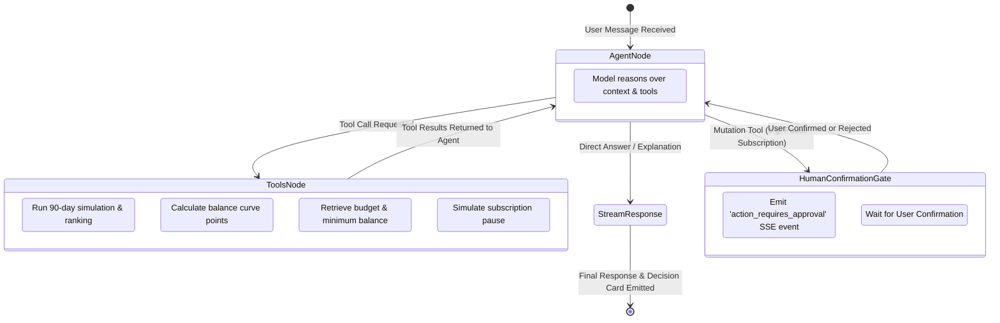
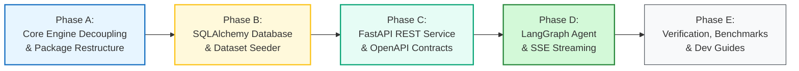

# 🏛️ Technical Design: Penny FastAPI Backend & Agentic AI Migration

**Document ID**: `SPEC-2026-09-13-PENNY-BACKEND`  
**Date**: September 13, 2026  
**Status**: Validated Design (Ready for Implementation Planning)  
**Target Architecture**: Modular FastAPI Service + LangGraph Agentic Brain + Decoupled Financial Engine (`core`)

---

## 1. Executive Summary & Context

Penny is evolving from a standalone Python batch-simulation CLI into a production-ready, agentic personal financial copilot. Penny answers the central financial question: **"Can I afford this?"** by projecting cash flow over a forward 90-day horizon, discovering recurrence patterns, evaluating multi-option payment strategies, and optimizing flexible expenses while strictly maintaining the user's minimum balance threshold.

This design outlines the complete transformation of Penny into a **FastAPI-powered backend** equipped with a stateful **LangGraph agent**, designed as an industry-standard architectural foundation and a practical learning stepping stone for fintech engineering at **OnePay**.

---

## 2. System Architecture & Boundaries

```mermaid
flowchart TD
    subgraph Client["📱 Frontend Client (React Native - Future)"]
        UI["Mobile App UI<br/>(Chat, Trajectory Charts, Sliders)"]
    end

    subgraph Backend["⚡ FastAPI Backend Service (backend/)"]
        subgraph APILayer["API Gateway & Routers (app/api/)"]
            R_Chat["/api/v1/chat/stream (SSE)"]
            R_Afford["/api/v1/affordability (REST)"]
            R_Sim["/api/v1/simulation/trajectory (REST)"]
            R_Users["/api/v1/users (CRUD)"]
            R_Events["/api/v1/events (CRUD)"]
        end

        subgraph AgentLayer["🧠 Agentic Brain (app/agent/)"]
            LG_Graph["LangGraph StateGraph<br/>(Intent Router + ReAct Agent)"]
            LG_Memory["Checkpointer (MemorySaver / AsyncSqliteSaver)"]
            LG_Tools["Financial Agent Tools<br/>(Simulate, Query, What-If, Convert)"]
            LG_HITL["Human-in-the-Loop Interrupt Gate"]
        end

        subgraph Schemas["📋 Contracts & Validation (app/schemas/)"]
            PydanticSchemas["Pydantic v2 Models & SSE Events"]
        end

        subgraph DBLayer["💾 Persistence & State (app/db/)"]
            SQLAlchemyModels["SQLAlchemy ORM Models"]
            DB_Session["Session Factory & Seeder"]
            SQLiteDB[("SQLite (Dev) / PostgreSQL (Prod)")]
        end

        subgraph CoreEngine["🔬 Core Financial Engine (backend/core/)"]
            Ledger["DailyLedger (90-Day Forward Simulation)"]
            Recurrence["RecurrenceDetector (DOM + Step Cadences)"]
            Safety["SafetyEngine (Headroom & Earliest Safe Date)"]
            Optimizer["SpendingOptimizer (Two-Tier Discretionary Search)"]
            Ranker["PlanRanker (6-Tier Lexicographic Sort)"]
            FX["ExchangeRateConverter (BFS Multi-Currency Graph)"]
            Linker["EventLinker & EvidenceManager"]
        end
    end

    UI <-->|SSE (Chat & Cards) / REST (Data)| APILayer
    R_Chat <--> LG_Graph
    LG_Graph <--> LG_Tools
    LG_Graph <--> LG_Memory
    LG_Tools <--> CoreEngine
    LG_Tools <--> LG_HITL
    APILayer <--> DBLayer
    DBLayer <--> SQLiteDB
    DBLayer <--> CoreEngine

    style Client fill:#e7f5ff,stroke:#1971c2,stroke-width:2px
    style APILayer fill:#fff9db,stroke:#fcc419,stroke-width:2px
    style AgentLayer fill:#e6fcf5,stroke:#0ca678,stroke-width:2px
    style CoreEngine fill:#d3f9d8,stroke:#2b8a3e,stroke-width:2px
    style DBLayer fill:#f8f9fa,stroke:#495057,stroke-width:1px
```

---

## 3. Key Design Decisions

| Architectural Area | Decision | Rationale |
|---|---|---|
| **Repository Layout** | Monorepo layout with `backend/` and future `frontend/` (React Native) | Clear separation of concerns while keeping full-stack development unified. |
| **Engine Isolation** | Decouple `code/` into `backend/core/` as a pure, zero-dependency Python package | Keeps core financial math and simulation 100% testable and independent from web frameworks. |
| **Data Architecture** | Clean Architecture: Pure dataclasses in `core/models/`, SQLAlchemy ORM in `app/db/`, Pydantic v2 in `app/schemas/` | Complete decoupling between HTTP schemas, DB tables, and domain entities. |
| **Persistence Engine** | SQLAlchemy with SQLite for local development; PostgreSQL-ready | Robust relational storage with a dataset seeder script to ingest `dataset/*.csv` for immediate dev & testing. |
| **Agentic Brain** | LangGraph `StateGraph` with ReAct Tool Nodes & Checkpointing | Industry-standard pattern used in fintech (OnePay); supports multi-turn memory, structured tool use, and streaming. |
| **Human-in-the-Loop** | Read & Simulate freely; interrupt for confirmation on budget mutations | Financial safety invariant: AI explores what-ifs freely, but requires explicit user approval before modifying actual spending limits. |
| **LLM Orchestration** | LangChain abstractions with multi-provider support (default: Groq, configurable to OpenAI/Anthropic via `.env`) | Ultra-fast agent inference (Groq Llama-3.3-70b) with zero vendor lock-in. |
| **Streaming Protocol** | Server-Sent Events (SSE) over HTTP POST (`/api/v1/chat/stream`) | Real-time text token streaming, tool call status events, and structured UI decision cards. Native reconnect and easy mobile consumption. |

---

## 4. Detailed Component Specifications

### 4.1. Directory Structure

```text
penny/
├── README.md                               # Root project README & roadmap
├── docs/                                   # Specifications, architecture, and developer guides
│   └── specs/
│       └── 2026-09-13-fastapi-backend-migration-design.md
│
├── dataset/                                # Evaluation CSVs, reference samples, and media images
│   ├── financial_profiles.csv
│   ├── financial_events.csv
│   ├── requests.csv
│   └── ...
│
├── backend/                                # ⚡ Complete Backend Package
│   ├── pyproject.toml                      # Modern packaging & dependencies
│   ├── requirements.txt                    # Standard pip requirements
│   ├── .env.example                        # Configuration template
│   │
│   ├── core/                               # 🔬 Pure Financial Simulation Engine (migrated from code/)
│   │   ├── __init__.py
│   │   ├── models/
│   │   │   ├── domain.py                   # UserProfile, FinancialEvent, PurchaseRequest, PaymentOption
│   │   │   └── results.py                  # CandidatePlan, OutputRow, AffordabilityStatus, PaymentMethod
│   │   ├── simulation/
│   │   │   ├── ledger.py                   # DailyLedger 90-day simulation
│   │   │   ├── recurrence.py               # RecurrenceDetector (DOM mode + integer step cadences)
│   │   │   └── safety.py                   # SafetyEngine (headroom, safe amount, earliest full date)
│   │   ├── optimizer/
│   │   │   ├── candidates.py               # CandidateGenerator (full, installment, partial, wait)
│   │   │   ├── spending.py                 # SpendingOptimizer (two-tier modification search)
│   │   │   └── ranker.py                   # PlanRanker (6-tier lexicographic tie-breaking)
│   │   ├── data/
│   │   │   ├── currency.py                 # ExchangeRateConverter (BFS multi-currency graph)
│   │   │   ├── evidence.py                 # EvidenceManager (OCR cache & message mutations)
│   │   │   ├── linker.py                   # EventLinker (transaction lifecycle resolution)
│   │   │   └── classifier.py               # IncomeStreamClassifier
│   │   ├── explanations/
│   │   │   └── templates.py                # DeterministicTemplateSynthesizer
│   │   └── pipeline.py                     # DecisionPipeline coordinator
│   │
│   ├── app/                                # 🌐 FastAPI Application & LangGraph Agent
│   │   ├── __init__.py
│   │   ├── main.py                         # FastAPI app factory, CORS, lifespan, exception handlers
│   │   ├── config.py                       # Pydantic Settings (env vars, DB URLs, LLM keys)
│   │   │
│   │   ├── db/                             # 💾 Database Layer
│   │   │   ├── __init__.py
│   │   │   ├── session.py                  # SQLAlchemy engine, sessionmaker, get_db dependency
│   │   │   ├── models.py                   # UserDB, EventDB, OptionDB, DecisionDB ORM models
│   │   │   └── seeder.py                   # Seeder script populating DB from dataset/ CSVs
│   │   │
│   │   ├── schemas/                        # 📋 Pydantic v2 API Contracts
│   │   │   ├── __init__.py
│   │   │   ├── profile.py                  # UserProfileCreate, UserProfileResponse, SpendingPrefs
│   │   │   ├── event.py                    # FinancialEventCreate, FinancialEventResponse
│   │   │   ├── affordability.py            # AffordabilityRequest, AffordabilityResponse, PaymentPlanItem
│   │   │   ├── simulation.py               # TrajectoryResponse, TrajectoryDayPoint
│   │   │   └── chat.py                     # ChatMessageRequest, StreamEvent, DecisionCardEvent
│   │   │
│   │   ├── services/                       # 🛠️ Business Logic Services
│   │   │   ├── __init__.py
│   │   │   ├── finance_service.py          # Bridges DB models to core.DecisionPipeline
│   │   │   └── simulation_service.py       # Computes trajectory comparison (baseline vs with-purchase)
│   │   │
│   │   ├── agent/                          # 🧠 LangGraph Agentic Brain
│   │   │   ├── __init__.py
│   │   │   ├── state.py                    # AgentState (messages, user_id, pending_action, context)
│   │   │   ├── tools.py                    # LangChain @tool definitions wrapping finance_service
│   │   │   ├── prompts.py                  # System prompts, persona, financial guidance rules
│   │   │   └── graph.py                    # StateGraph construction, conditional edges, HITL gate
│   │   │
│   │   └── api/                            # 🚀 Route Controllers
│   │       ├── __init__.py
│   │       ├── v1/
│   │       │   ├── __init__.py
│   │       │   ├── api.py                  # APIRouter assembling sub-routers
│   │       │   ├── chat.py                 # POST /chat/stream (SSE streaming)
│   │       │   ├── affordability.py        # POST /affordability/evaluate (REST)
│   │       │   ├── simulation.py           # GET /simulation/trajectory/{user_id} (REST)
│   │       │   ├── users.py                # CRUD /users/{user_id} (REST)
│   │       │   └── events.py               # CRUD /users/{user_id}/events (REST)
│   │
│   ├── tests/                              # 🧪 Backend Test Suite
│   │   ├── test_core/                      # Decoupled core engine tests (all 85 existing tests)
│   │   ├── test_api/                       # FastAPI endpoint integration tests (TestClient)
│   │   └── test_agent/                     # LangGraph workflow, tool execution, and HITL tests
│   │
│   └── cli.py                              # 💻 Backwards-compatible CLI for dataset evaluation
│
└── frontend/                               # 📱 Cross-Platform Mobile Client (React Native - Phase 3)
```

---

### 4.2. LangGraph Agent State Machine



#### State Definition (`app/agent/state.py`):
```python
from typing import Annotated, Any, Dict, List, Optional
from langgraph.graph.message import add_messages
from pydantic import BaseModel, Field

class AgentState(BaseModel):
    messages: Annotated[List[Any], add_messages]
    user_id: str
    current_request_id: Optional[str] = None
    pending_action: Optional[Dict[str, Any]] = None  # For Human-in-the-loop approval
    financial_context: Optional[Dict[str, Any]] = None
```

#### Agent Tools (`app/agent/tools.py`):
1. `evaluate_purchase(user_id: str, requested_amount: float, desired_completion_date: str, allows_partial: bool = False, request_text: str = "")`:
   Executes the full 10-stage `DecisionPipeline` and returns the structured `CandidatePlan` and explanation.
2. `get_cashflow_trajectory(user_id: str, prospective_amount: Optional[float] = None)`:
   Returns daily balance points over 90 days, comparing baseline vs prospective spend.
3. `get_user_financial_profile(user_id: str)`:
   Retrieves balances, minimum reserve, protected categories, and flexible categories.
4. `simulate_spending_reduction(user_id: str, categories_to_stop: List[str], categories_to_reduce: Dict[str, float])`:
   Runs sandbox simulation showing how much cash-flow headroom would be unlocked without saving changes.
5. `request_spending_modification_approval(user_id: str, proposed_changes: List[str])`:
   Triggers a human-in-the-loop interruption gate asking the user for confirmation before committing changes to their profile.

---

### 4.3. API Endpoint Contracts

#### 1. `POST /api/v1/chat/stream` (Server-Sent Events)
- **Request Body**:
  ```json
  {
    "user_id": "user_01",
    "message": "Can I afford to buy this gaming laptop for $1,200 by next month?",
    "session_id": "sess_abc123"
  }
  ```
- **SSE Stream Sequence**:
  - `event: status` -> `{"text": "Analyzing your cash flow and upcoming commitments..."}`
  - `event: tool_call` -> `{"tool": "evaluate_purchase", "input": {"requested_amount": 1200.0, "desired_completion_date": "2026-10-15"}}`
  - `event: token` -> `{"delta": "Based "}` ... `{"delta": "on your financial forecast..."}`
  - `event: decision_card` ->
    ```json
    {
      "affordability_status": "affordable_with_plan",
      "recommended_payment_method": "installments",
      "amount_safe_to_pay": 400.0,
      "payment_plan": "2026-09-15:400.00|2026-10-15:400.00|2026-11-15:400.00",
      "earliest_date_for_full_payment": "2026-11-20",
      "spending_changes_needed": "none",
      "decision_explanation": "Pay $400 today and split into 3 monthly installments. Your balance remains comfortably above your $500 safety reserve."
    }
    ```
  - `event: done` -> `{"session_id": "sess_abc123"}`

#### 2. `GET /api/v1/simulation/trajectory/{user_id}` (REST)
- **Query Parameters**: `prospective_amount: Optional[float]`, `purchase_date: Optional[str]`
- **Response**:
  ```json
  {
    "user_id": "user_01",
    "currency": "USD",
    "minimum_balance_to_keep": 500.0,
    "points": [
      {"date": "2026-09-13", "baseline_balance": 2450.0, "with_purchase_balance": 1250.0},
      {"date": "2026-09-14", "baseline_balance": 2450.0, "with_purchase_balance": 1250.0},
      {"date": "2026-09-15", "baseline_balance": 3950.0, "with_purchase_balance": 2750.0}
    ],
    "lowest_projected_balance": 820.0,
    "is_safe": true
  }
  ```

---

## 5. Migration Execution Phases



### Phase A: Core Engine Decoupling & Package Restructure
1. Create `backend/` package directory layout with `backend/core/`.
2. Move core simulation, recurrence, optimizer, currency, evidence, linker, and model modules from `code/` to `backend/core/`.
3. Keep `core/` completely pure Python (no FastAPI or DB dependencies).
4. Relocate tests to `backend/tests/test_core/` and verify all 85 existing tests pass.
5. Provide `backend/cli.py` to ensure backwards compatibility with `python3 code/main.py`.

### Phase B: Database Layer & Dataset Seeder
1. Implement SQLAlchemy ORM models in `backend/app/db/models.py` (`UserDB`, `FinancialEventDB`, `PaymentOptionDB`, `DecisionRecordDB`).
2. Create SQLite / PostgreSQL session factory and connection lifecycle in `backend/app/db/session.py`.
3. Create `backend/app/db/seeder.py` to ingest `dataset/*.csv` directly into the database for immediate testing and sample verification.

### Phase C: FastAPI REST Application
1. Configure FastAPI app in `backend/app/main.py` with CORS, logging, and error handlers.
2. Build Pydantic v2 schemas in `backend/app/schemas/`.
3. Implement `FinanceService` bridging DB records to `core.DecisionPipeline`.
4. Implement REST routers for `/affordability/evaluate`, `/simulation/trajectory`, `/users`, and `/events`.
5. Write integration tests using `httpx.AsyncClient` / `TestClient`.

### Phase D: LangGraph Agent & SSE Streaming
1. Add dependencies (`langgraph`, `langchain-core`, `langchain-groq`).
2. Define `AgentState` and financial tool nodes in `backend/app/agent/`.
3. Construct the state graph with ReAct pattern and human-in-the-loop interruption gates.
4. Implement the SSE streaming router in `backend/app/api/v1/chat.py`.
5. Connect session checkpointer (`MemorySaver` / `AsyncSqliteSaver`).

### Phase E: Verification, Benchmarking & Documentation
1. Run full test suite: core tests, API endpoint tests, and agent workflow tests.
2. Verify benchmark evaluation using the new backend against `dataset/sample_requests.csv`.
3. Write comprehensive developer guides and interactive API documentation (Swagger `/docs`).

---

## 6. Verification & Invariants Checklist

- [ ] **Financial Invariant Preservation**: Zero balance breach guarantee must remain 100% intact across all 90-day simulations.
- [ ] **Decoupled Purity**: `backend/core/` must never import from `backend/app/`.
- [ ] **Backwards Compatibility**: Batch evaluation CLI continues to operate seamlessly on `dataset/`.
- [ ] **Streaming Determinism**: SSE stream emits well-formed event payloads (`status`, `token`, `tool_call`, `decision_card`, `done`).
- [ ] **Human-in-the-Loop Safety**: No tool that mutates user profile or spending preferences may execute without explicit confirmation.
